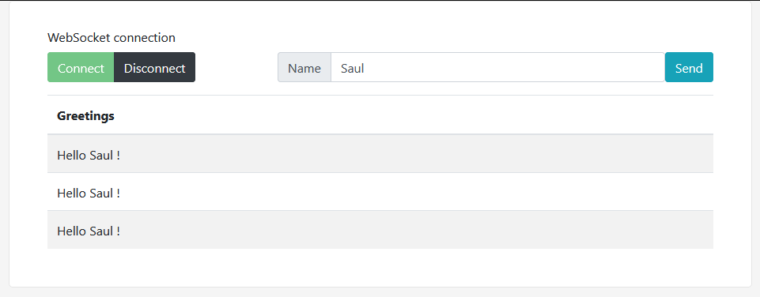

# Getting Started

Use raw websocket by defining your own messaging protocol to connect to spring websocket using TextWebSocketHandler.

***WITHOUT STOMP AND SOCKJS***

### Modified by saulpalv (Saul Palazuelos)

 **Original author only2dhir (Dhiraj Ray)**
 * original source https://github.com/only2dhir/spring-websocket-without-stomp
 * original post https://www.devglan.com/spring-boot/spring-websocket-integration-example-without-stomp
 
 Capture:
 
 
 
 Changelog :
  * use gradle project
  * added original sources
  * added javadoc
  * added SocketHandler.afterConnectionClosed()
  * added option to send a message to all active sessions
  * enabled connections from all origins
  * updated spring dependencies (v1.4.1 to v2.3.3)
  * updated js client dependencies (bootstrap, jquery)
  * updated js client GUI style